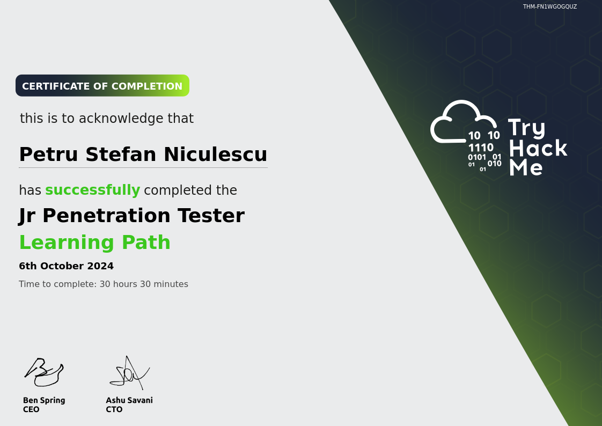

I am a young aspiring Penetration Tester & Cyber Security student looking for an internship or Junior role in Penetration testing, Governance, Risk, Compliance (GRC), Cyber Analysis, Systems Administrator or IT Helpdesk.

# Work experience

MonetiseMe.co 

2/2024 - 7/2024

Governance, Risk, and Compliance (GRC) consultant (part-time)

> - Ensured the company followed cybersecurity standards, keeping our systems and data secure while meeting compliance requirements. (GDPR, PCI DSS ,..)
> - Oversaw legal and cybersecurity aspects, implementing guidance and controls to guarantee safe handling of sensitive information and full regulatory compliance.

> _While I do lack experience in the **technical** world of Cyber Security, I have gone through countless labs simulating real-world environments whether it is being in the Blue Team or recently in Offensive security._

[More Projects and hands-on experience](./projects)

## Certifications

> Google Cybersecurity Professional Certificate.
> 

  .                                 .                                   .                    .   .  
                   .               .   .     .  . .        .           .                            
 .           .             .                                      .  . .   .         .              
                   .                                       .                            .           
          . .             .                                                      .               .  
                 . .               .    .  .       .  .                    .    .     .         .   
                           .           .                               .  .  .  .       .        .  
                                              .       .                  . .        . .             
                        .     ...-+*#####+-:..        ...:-------:....         .             .      
                           .:+################*-....:-----------------:..   . . .  .       .    .   
       .             .   :+######################+=----------------------:.              .          
  .              . .   .+#######################++++=----------------------:.      .        ...     
                     .-#######################*++++++==----------------------..                     
                    .-#######################+++++++++==--------------------=-:. .                . 
                    :#######################+++++++++++=-----------------------. .                  
       . .         .#######################*++++++++++++=-----------------------.         .   .     
                   =#######################++++++++++++++=----------------------:                  .
       .          .*######################*++++++++++++++=-----------------------    .     .        
         .  .     .*######################*++++++++++++++=-----------------------.                  
.             .    *######################*++++++++++++++=-----------------------..             .   
  .           .    =#######################++++++++++++++=----------------------:      .          . 
..                 .#######################*++++++++++++=-----------------------.       .     .     
                  . -#######################++++++++++++=----------------------..       .         . 
                    .=#######################++++++++++=----------------------:.    ...    .        
             .       .=#######################+++++++===---------------------:...       .   .     . 
                       .*######################*++++==----------------------.  ..   .       .       
      .             .   .:+######################*==----------------------..         ..             
                     .     .-*#################=....:----------------=-:..       .                  
           .                  ..-+*********=:..       ..:----------:..        .                     
                                  .     .      .     .     .     .             .               .    
              .             .                .                             .        .      ..       
   . .                               .                                        .                     
                            .        . .                           .          ...                .  
                                             .        .                          .                 .
                   .  .               ..                                      .                     
           .     .                     .               .          .          .     .    .           

> - Gained an understanding of key cybersecurity concepts like the CIA triad (confidentiality, integrity, availability).
> - Learned how to identify and manage security risks, applying best practices to protect systems.
> - Configured network security settings and practiced defending networks from intrusions.
> - Worked with Linux for file management and user administration, using Bash commands.
> - Used SQL to query databases for security purposes, such as analyzing login data.
> - Detected incidents by analyzing network traffic and using tools like IDS and SIEM for incident response.
> - Automated security tasks with Python, including scripting for log analysis and threat detection.
>> **Skills learned: Linux, Intrusion Detection, SQL (Basics), Python (Basics) CLI, SIEM, Audits, Bash, Incident Response, NIST CSF, RMF.**

> TryHackMe Jr. Penetration Tester.
> 
> - Reconnaissance and Enumeration: Techniques like scanning and information gathering using tools such as Nmap to map open ports, services, and vulnerabilities.
> - Web Application Security: Exploiting common vulnerabilities such as file inclusion (Local File Inclusion - LFI, Remote File Inclusion - RFI), cross-site scripting (XSS), and SQL injections.
> - Exploitation: Practical exercises involving attacking both Linux and Windows machines, focusing on vulnerabilities like misconfigurations and unpatched systems.
> - Privilege Escalation: Hands-on labs focused on escalating privileges in both Linux (e.g., SUID misconfigurations, cron jobs) and Windows (e.g., registry manipulation, exploiting weak permissions).
> - Post-Exploitation: Techniques such as capturing flags, reading sensitive files, and persistence mechanisms after gaining access to a system.
> - File Inclusion Vulnerabilities: Exercises on exploiting file inclusion issues, bypassing filters, and capturing flags through directory traversal and null byte injections.
>> **Skills learned: Linux, Intrusion Detection, SQL Injections, Python (Basics), Bash, Metasploit Framework, msfvenom, Burp Suite, nmap, XSS, SSRF, IDOR, Reconnaissance, OSINT, Windows Registry, Powershell, Kali Linux, Wireshark, Virtual Machines.**

