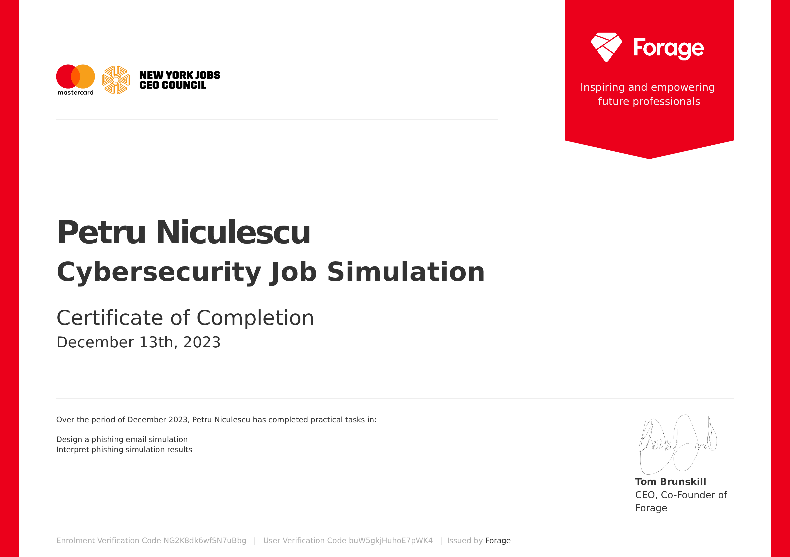
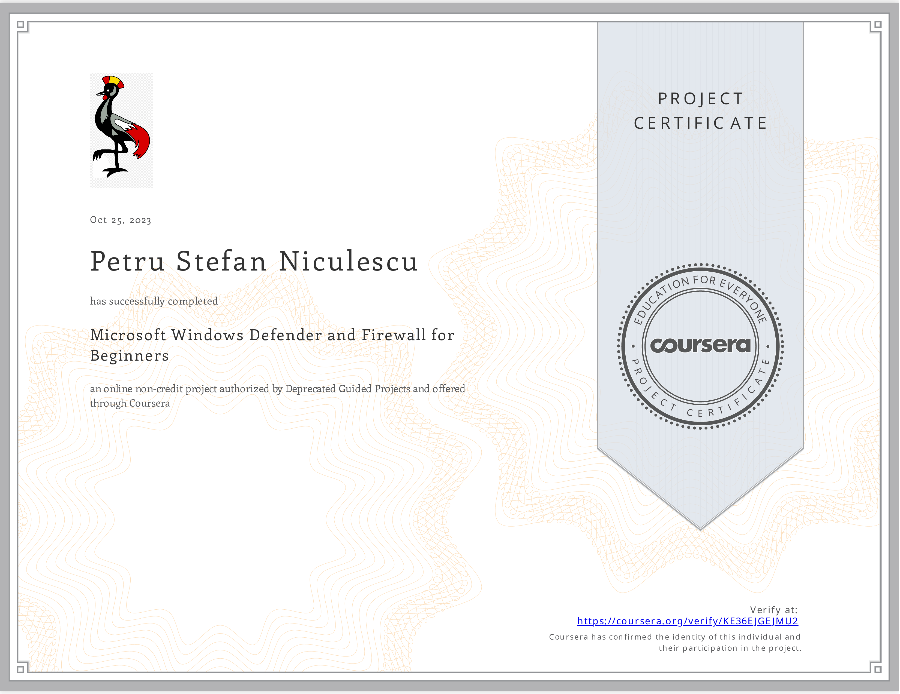

[Home](./index)

# Projects

> - [My TryHackMe page](https://tryhackme.com/r/p/wpetru) (badges, completed rooms, level, rank)
> 
> - _github won't let me display my iframe thm badge so this badge might not be updated. Please visit the link above in order to see my badges, etc..._

> Mastercard Cybersecurity virtual experience program on Forage
> 
> - Completed a job simulation where I served as an analyst on Mastercard’s Security Awareness Team 
> - Helped identify and report security threats such as phishing 
> - Analyzed and identified which areas of the business needed more robust security training and implemented training courses and procedures for those teams.

> Wireshark for Beginners : Capture Packets
> 
> - Installed Wireshark on Ubuntu,Utilized Wireshark to analyze HTTP/S and RDP traffic, and used a display filter to detect IP Addresses in packets.

> Microsoft Windows Defender for Beginners.
> 
> - Configuring and updating Microsoft Windows Defender, Enabling and configuring Microsoft Firewall.

> Analyze Network Traffic with TCPDump
> 
> - Utilized TCPDump to capture Network Traffic, Analyzed Network Traffic, created shell scripts to capture, filter and log capture. 

